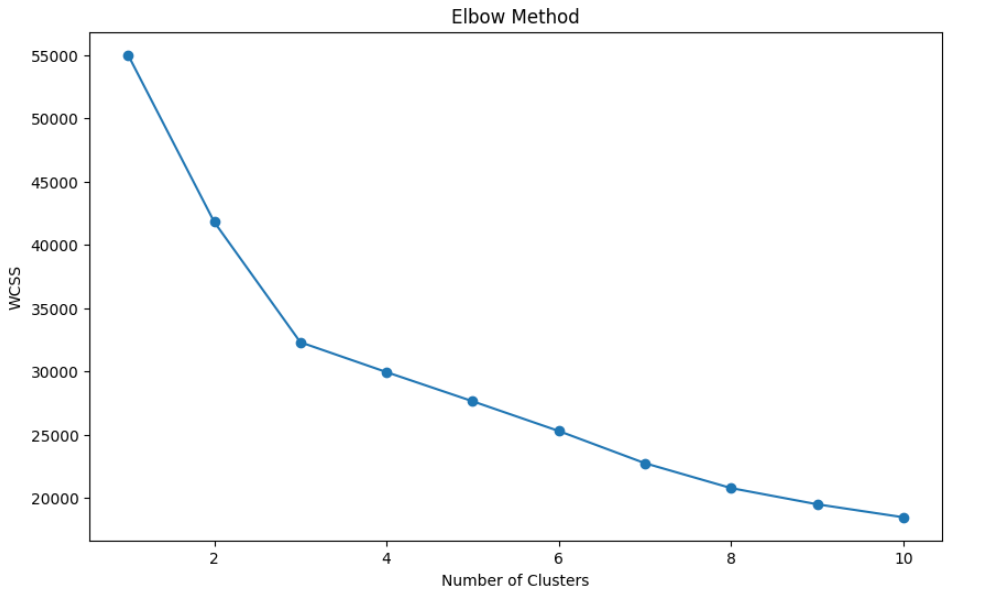

```python
import pandas as pd
from sklearn.model_selection import train_test_split
from sklearn.linear_model import LinearRegression
from sklearn.metrics import mean_squared_error
from sklearn.preprocessing import StandardScaler
from sklearn.metrics import accuracy_score, precision_score, recall_score, confusion_matrix, classification_report
from sklearn.linear_model import LogisticRegression
from sklearn.cluster import KMeans
import matplotlib.pyplot as plt


file_path = 'dataset for assignment 2.csv'
data = pd.read_csv(file_path)

data.head()

```


<div>

<table border="1" class="dataframe">
  <thead>
    <tr style="text-align: right;">
      <th></th>
      <th>User ID</th>
      <th>Gender</th>
      <th>Age</th>
      <th>Activity Level</th>
      <th>Location</th>
      <th>App Sessions</th>
      <th>Distance Travelled (km)</th>
      <th>Calories Burned</th>
    </tr>
  </thead>
  <tbody>
    <tr>
      <th>0</th>
      <td>1</td>
      <td>Female</td>
      <td>22</td>
      <td>Active</td>
      <td>Suburban</td>
      <td>151</td>
      <td>140</td>
      <td>728</td>
    </tr>
    <tr>
      <th>1</th>
      <td>2</td>
      <td>Male</td>
      <td>50</td>
      <td>Active</td>
      <td>Rural</td>
      <td>157</td>
      <td>115</td>
      <td>523</td>
    </tr>
    <tr>
      <th>2</th>
      <td>3</td>
      <td>Male</td>
      <td>36</td>
      <td>Active</td>
      <td>Urban</td>
      <td>178</td>
      <td>163</td>
      <td>795</td>
    </tr>
    <tr>
      <th>3</th>
      <td>4</td>
      <td>Female</td>
      <td>36</td>
      <td>Active</td>
      <td>Suburban</td>
      <td>155</td>
      <td>85</td>
      <td>715</td>
    </tr>
    <tr>
      <th>4</th>
      <td>5</td>
      <td>Male</td>
      <td>34</td>
      <td>Sedentary</td>
      <td>Rural</td>
      <td>95</td>
      <td>71</td>
      <td>439</td>
    </tr>
  </tbody>
</table>
</div>


```python
data.describe()
```


<div>
<table border="1" class="dataframe">
  <thead>
    <tr style="text-align: right;">
      <th></th>
      <th>User ID</th>
      <th>Age</th>
      <th>App Sessions</th>
      <th>Distance Travelled (km)</th>
      <th>Calories Burned</th>
    </tr>
  </thead>
  <tbody>
    <tr>
      <th>count</th>
      <td>5000.000000</td>
      <td>5000.000000</td>
      <td>5000.000000</td>
      <td>5000.000000</td>
      <td>5000.000000</td>
    </tr>
    <tr>
      <th>mean</th>
      <td>2500.500000</td>
      <td>38.423600</td>
      <td>124.366400</td>
      <td>92.550400</td>
      <td>432.316000</td>
    </tr>
    <tr>
      <th>std</th>
      <td>1443.520003</td>
      <td>12.160631</td>
      <td>42.689317</td>
      <td>36.746095</td>
      <td>187.427426</td>
    </tr>
    <tr>
      <th>min</th>
      <td>1.000000</td>
      <td>18.000000</td>
      <td>50.000000</td>
      <td>26.000000</td>
      <td>102.000000</td>
    </tr>
    <tr>
      <th>25%</th>
      <td>1250.750000</td>
      <td>28.000000</td>
      <td>89.000000</td>
      <td>63.000000</td>
      <td>285.000000</td>
    </tr>
    <tr>
      <th>50%</th>
      <td>2500.500000</td>
      <td>39.000000</td>
      <td>124.000000</td>
      <td>89.000000</td>
      <td>406.000000</td>
    </tr>
    <tr>
      <th>75%</th>
      <td>3750.250000</td>
      <td>49.000000</td>
      <td>161.000000</td>
      <td>118.000000</td>
      <td>560.000000</td>
    </tr>
    <tr>
      <th>max</th>
      <td>5000.000000</td>
      <td>59.000000</td>
      <td>199.000000</td>
      <td>195.000000</td>
      <td>987.000000</td>
    </tr>
  </tbody>
</table>
</div>


```python
numerical_data = data.select_dtypes(include=['float64', 'int64'])
correlation_matrix = numerical_data.corr()

correlation_matrix

```


<div>

<table border="1" class="dataframe">
  <thead>
    <tr style="text-align: right;">
      <th></th>
      <th>User ID</th>
      <th>Age</th>
      <th>App Sessions</th>
      <th>Distance Travelled (km)</th>
      <th>Calories Burned</th>
    </tr>
  </thead>
  <tbody>
    <tr>
      <th>User ID</th>
      <td>1.000000</td>
      <td>0.003109</td>
      <td>-0.011143</td>
      <td>-0.002194</td>
      <td>0.000204</td>
    </tr>
    <tr>
      <th>Age</th>
      <td>0.003109</td>
      <td>1.000000</td>
      <td>-0.001718</td>
      <td>-0.003733</td>
      <td>-0.003620</td>
    </tr>
    <tr>
      <th>App Sessions</th>
      <td>-0.011143</td>
      <td>-0.001718</td>
      <td>1.000000</td>
      <td>0.857045</td>
      <td>0.795404</td>
    </tr>
    <tr>
      <th>Distance Travelled (km)</th>
      <td>-0.002194</td>
      <td>-0.003733</td>
      <td>0.857045</td>
      <td>1.000000</td>
      <td>0.680502</td>
    </tr>
    <tr>
      <th>Calories Burned</th>
      <td>0.000204</td>
      <td>-0.003620</td>
      <td>0.795404</td>
      <td>0.680502</td>
      <td>1.000000</td>
    </tr>
  </tbody>
</table>
</div>


```python
gender_analysis = data.groupby('Gender').agg({
    'App Sessions': 'mean',
    'Distance Travelled (km)': 'mean',
    'Calories Burned': 'mean'
}).reset_index()

gender_analysis
```


<div>

<table border="1" class="dataframe">
  <thead>
    <tr style="text-align: right;">
      <th></th>
      <th>Gender</th>
      <th>App Sessions</th>
      <th>Distance Travelled (km)</th>
      <th>Calories Burned</th>
    </tr>
  </thead>
  <tbody>
    <tr>
      <th>0</th>
      <td>Female</td>
      <td>124.619009</td>
      <td>92.508530</td>
      <td>434.103574</td>
    </tr>
    <tr>
      <th>1</th>
      <td>Male</td>
      <td>124.121355</td>
      <td>92.591017</td>
      <td>430.581954</td>
    </tr>
  </tbody>
</table>
</div>


```python
data_encoded = pd.get_dummies(data, columns=['Gender', 'Activity Level', 'Location'])

X = data_encoded.drop(columns=['User ID', 'Calories Burned'])
y = data_encoded['Calories Burned']
X_train, X_test, y_train, y_test = train_test_split(X, y, test_size=0.2, random_state=42)
model = LinearRegression()
model.fit(X_train, y_train)
y_pred = model.predict(X_test)
mse = mean_squared_error(y_test, y_pred)
print(f'Mean Squared Error: {mse}')
feature_importance = pd.Series(model.coef_, index=X.columns).sort_values(ascending=False)
print('Feature Importance:\n', feature_importance)
```

    Mean Squared Error: 13054.869130210587
    Feature Importance:
     Location_Rural              4.645824
    App Sessions                3.513941
    Activity Level_Moderate     1.124619
    Gender_Female               0.571498
    Age                         0.052453
    Distance Travelled (km)    -0.045714
    Activity Level_Active      -0.255413
    Gender_Male                -0.571498
    Activity Level_Sedentary   -0.869205
    Location_Suburban          -1.747726
    Location_Urban             -2.898099
    dtype: float64
    


```python
data = data.dropna()
data_encoded = pd.get_dummies(data, columns=['Gender', 'Activity Level', 'Location'])
X = data_encoded.drop(columns=['User ID', 'Calories Burned'])
y = data_encoded['Calories Burned']
X_train, X_test, y_train, y_test = train_test_split(X, y, test_size=0.2, random_state=42)
reg_model = LinearRegression()
reg_model.fit(X_train, y_train)
y_pred = reg_model.predict(X_test)
mse = mean_squared_error(y_test, y_pred)
print(f'Mean Squared Error: {mse}')
feature_importance = pd.Series(reg_model.coef_, index=X.columns).sort_values(ascending=False)
print('Feature Importance:\n', feature_importance)
cluster_features = data_encoded.drop(columns=['User ID', 'Calories Burned'])
scaler = StandardScaler()
cluster_features_scaled = scaler.fit_transform(cluster_features)
wcss = []
for i in range(1, 11):
    kmeans = KMeans(n_clusters=i, random_state=42)
    kmeans.fit(cluster_features_scaled)
    wcss.append(kmeans.inertia_)
plt.figure(figsize=(10, 6))
plt.plot(range(1, 11), wcss, marker='o')
plt.title('Elbow Method')
plt.xlabel('Number of Clusters')
plt.ylabel('WCSS')
plt.show()
optimal_clusters = 3
kmeans = KMeans(n_clusters=optimal_clusters, random_state=42)
data['Cluster'] = kmeans.fit_predict(cluster_features_scaled)
cluster_centroids = pd.DataFrame(scaler.inverse_transform(kmeans.cluster_centers_), columns=cluster_features.columns)
print('Cluster Centroids:\n', cluster_centroids)
numeric_columns = data.select_dtypes(include='number').columns
cluster_analysis = data[numeric_columns].groupby('Cluster').mean()
print('Cluster Analysis:\n', cluster_analysis)
```

    Mean Squared Error: 13054.869130210587
    Feature Importance:
     Location_Rural              4.645824
    App Sessions                3.513941
    Activity Level_Moderate     1.124619
    Gender_Female               0.571498
    Age                         0.052453
    Distance Travelled (km)    -0.045714
    Activity Level_Active      -0.255413
    Gender_Male                -0.571498
    Activity Level_Sedentary   -0.869205
    Location_Suburban          -1.747726
    Location_Urban             -2.898099
    dtype: float64
    


    

    


    Cluster Centroids:
              Age  App Sessions  Distance Travelled (km)  Gender_Female  \
    0  38.618224    124.159746                92.554210       0.478085   
    1  38.208333    174.202819               129.253064       0.502451   
    2  38.432069     74.810282                55.888617       0.497552   
    
       Gender_Male  Activity Level_Active  Activity Level_Moderate  \
    0     0.521915          -6.106227e-16             1.000000e+00   
    1     0.497549           1.000000e+00            -9.992007e-16   
    2     0.502448          -5.551115e-16            -9.992007e-16   
    
       Activity Level_Sedentary  Location_Rural  Location_Suburban  Location_Urban  
    0             -4.440892e-16        0.354671           0.344867        0.300461  
    1             -3.330669e-16        0.328431           0.318627        0.352941  
    2              1.000000e+00        0.326193           0.342717        0.331089  
    Cluster Analysis:
                  User ID        Age  App Sessions  Distance Travelled (km)  \
    Cluster                                                                  
    0        2515.599769  38.618224    124.159746                92.554210   
    1        2474.962623  38.208333    174.202819               129.253064   
    2        2509.982252  38.432069     74.810282                55.888617   
    
             Calories Burned  
    Cluster                   
    0             432.080161  
    1             605.996936  
    2             259.097919  
    


```python
threshold = data_encoded['Calories Burned'].median()
data_encoded['High_Calories_Burned'] = (data_encoded['Calories Burned'] > threshold).astype(int)
X = data_encoded.drop(columns=['User ID', 'Calories Burned', 'High_Calories_Burned'])
y = data_encoded['High_Calories_Burned']
X_train, X_test, y_train, y_test = train_test_split(X, y, test_size=0.2, random_state=42)
X_train_scaled = scaler.fit_transform(X_train)
X_test_scaled = scaler.transform(X_test)
classifier = LogisticRegression(random_state=42)
classifier.fit(X_train_scaled, y_train)
y_pred = classifier.predict(X_test_scaled)
accuracy = accuracy_score(y_test, y_pred)
precision = precision_score(y_test, y_pred)
recall = recall_score(y_test, y_pred)

print(f'Accuracy: {accuracy}')
print(f'Precision: {precision}')
print(f'Recall: {recall}')
print('Confusion Matrix:\n', confusion_matrix(y_test, y_pred))
print('Classification Report:\n', classification_report(y_test, y_pred))
```

    Accuracy: 0.811
    Precision: 0.7723880597014925
    Recall: 0.8607068607068608
    Confusion Matrix:
     [[397 122]
     [ 67 414]]
    Classification Report:
                   precision    recall  f1-score   support
    
               0       0.86      0.76      0.81       519
               1       0.77      0.86      0.81       481
    
        accuracy                           0.81      1000
       macro avg       0.81      0.81      0.81      1000
    weighted avg       0.82      0.81      0.81      1000
    
    


```python

```
